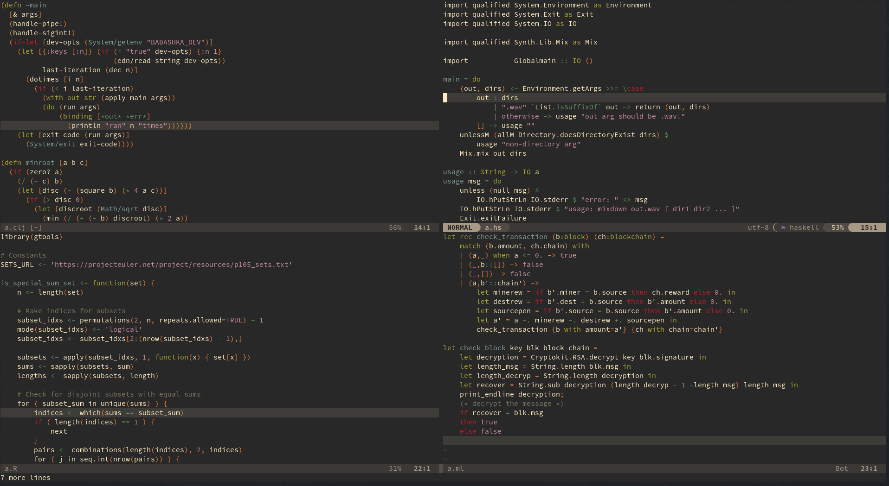

# 📀 Vinyl

This scheme has been modelled on the examples in [this talk](https://www.youtube.com/watch?v=tJR-MvPQhT8). I reached out to the speaker but got no reply. He probably used [this one](https://github.com/runarorama/gruvbox) but by the time I found out, this scheme was already almost finished and it has turned out somewhat different, and in fact more to my liking, so… Behold, an immitation of a [modification](https://github.com/runarorama/gruvbox) of a [modification](https://github.com/dkasak/gruvbox) of [gruvbox](https://github.com/morhetz/gruvbox).

A warm, feel-good theme with slightly unusual semantics.



⚠️ This is an early version. Expect breaking changes, whatever this might mean in this case. Also, there aren’t any extras except [nvim-lualine](https://github.com/nvim-lualine/lualine.nvim) but let me know if you’d like me to add something. There’s TreeSitter support though, so there’s that.


## Installation

The theme should work with any package manager. For example, with [lazy.nvim](https://github.com/folke/lazy.nvim), add the following to your `plugins.lua`:

```lua
{ "kamwitsta/vinyl.nvim" },
```


## Configuration

At present, only one option is available: `overrides`. Using lazy.nvim:

```lua
{
    "kamwitsta/vinyl.nvim" 
    config = function()
        require("vinyl").setup({
            overrides = {
                ["@string"] = {fg="#00ff00"},
            },
        })
    end
},
```


## Acknowledgements

- [This talk](https://www.youtube.com/watch?v=tJR-MvPQhT8)
